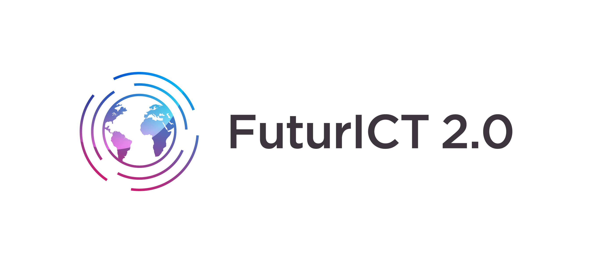
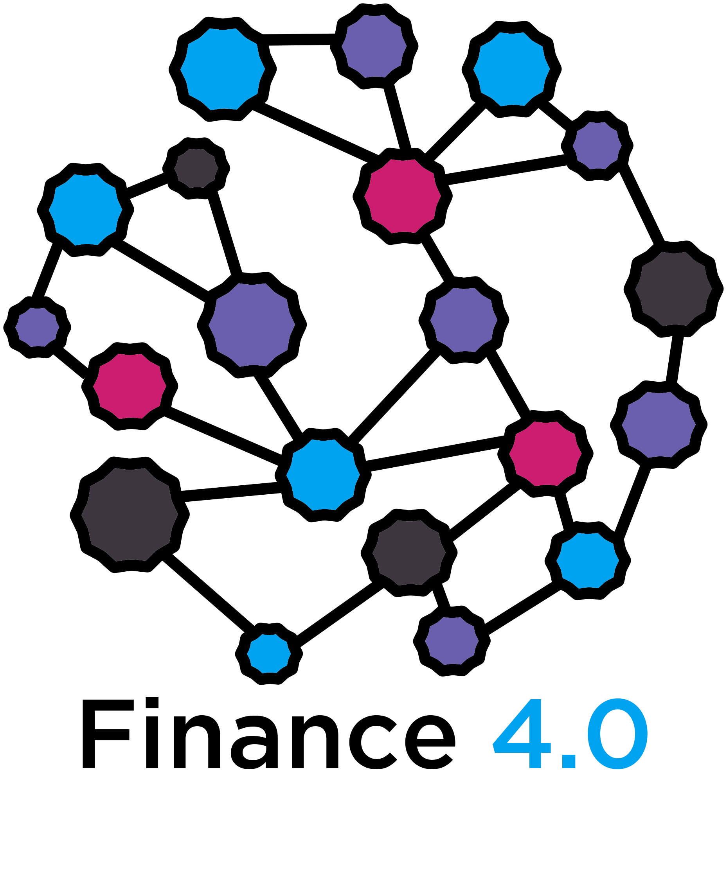

# DLT4PI-FIN4
Team **Action Magic for Finance 4.0** in the SoSe2019 [TUM](https://www.tum.de/) course [*Advanced Practical Course - Blockchain technology for public sector innovation*](https://campus.tum.de/tumonline/wbLv.wbShowLVDetail?pStpSpNr=950404716&pSpracheNr=2) at [fortiss](https://www.fortiss.org/) with [Marcus Dapp](http://digisus.com/) ([FuturICT 2.0](https://futurict2.eu/)) from [ETH Zürich](https://www.ethz.ch/) as partner.

**Team**: [@simonzachau](https://github.com/simonzachau) | [@benjaminaaron](https://github.com/benjaminaaron) |  [@sangeetajoseph8](https://github.com/sangeetajoseph8) | [@ShreshthaKriti](https://github.com/ShreshthaKriti) | [@leonKObi](https://github.com/leonKObi)

<table border="0"><tr><td>
<a href="https://futurict2.eu/"></a></td>
<td>

</td></tr></table>

YouTube Image Film:

[](http://www.youtube.com/watch?v=oNlKdHjvExo "Finance 4.0")

---

## Setup

#### Install `yarn` and `truffle`
If you don't have them yet.

```sh
# yarn
curl -sS https://dl.yarnpkg.com/debian/pubkey.gpg | sudo apt-key add -
echo "deb https://dl.yarnpkg.com/debian/ stable main" | sudo tee /etc/apt/sources.list.d/yarn.list
sudo apt-get update && sudo apt-get install yarn

# truffle
sudo apt install npm
sudo npm install -g truffle

# this only if you get permission-errors regarding truffle
~/.config$ sudo chmod -R 777 truffle/
```

#### For testnet-deployment 
Add and fill this file: `src/config/ethereum-keys.json`
```json
{
    "MNEMONIC": "",
    "INFURA_API_KEY": ""
}
```

#### Install dependencies
```sh
yarn install
```

#### Compile and migrate the smart contracts

1. `truffle compile`
2. `ganache-cli --port=7545 --allowUnlimitedContractSize`
3. `truffle migrate` to place the smart contract on the local blockchain
4. install the [Metamask](https://metamask.io/) browser extension, paste `MNEMONIC` from Ganache into the `seed` input and `http://127.0.0.1:7545` into `custom RPC` input

### Start the react app
```sh
yarn start
```

[//]: <> (
Via the gear-icon in Ganache, *Add Project* and select the `truffle-config.js` to add this project and therewith be able to see the values in the smart contract. Click *Save and Restart* top right. This might throw an error on Ganache - if that happens it doesn't seem possible to see the smart contract via Ganache unfortunately. TODO: fix this?
)

### BigchainDB netwoek setup 

1. Install Git, Make, Docker, and Docker Compose on your local machine.
2. `git clone git@github.com:bigchaindb/bigchaindb.git`
3. `cd bigchaindb`
4. `make run`
